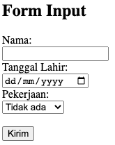
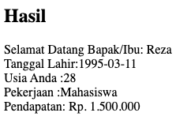

# Membuat form input sederhana menggunakan PHP

## Berikut adalah code untuk membuat form input

```html
<form method="post">
    <label for="fNama">Nama: </label><br>
    <input type="text" id="fNama" name="nama"><br>
    <label for="fTanggal">Tanggal Lahir:</label> <br>
    <input type="date" name="tanggal" id="fTanggal"><br>
    <label for="fPekerjaan">Pekerjaan: </label><br>
    <select name="pekerjaan" id="fPekerjaan">
        <option value="Tidak Ada">Tidak ada</option>
        <option value="Mahasiswa">Mahasiswa</option>
        <option value="Freelance">Freelance</option>
        <option value="Karyawan">Karyawan</option>
    </select>
    <br><br>
    <input type="submit" name="submit" value="Kirim">
</form>
```

### Maka akan menghasilkan ouput seperti dibawah ini:


## Berikut adalah code untuk bagian Hasil:
```php
    <?php

    if (isset($_POST["submit"])) {
        echo '<h2>Hasil</h2>';
        echo 'Selamat Datang Bapak/Ibu: ' . $_POST['nama'] . '<br>';
        echo 'Tanggal Lahir:' . $_POST["tanggal"] . '<br>';
        echo 'Usia Anda :' . date_diff(date_create($_POST["tanggal"]), date_create('today'))->y . "<br>";
        echo 'Pekerjaan :' . $_POST["pekerjaan"] . '<br>';
        if ($_POST["pekerjaan"] == "Mahasiswa") {
            echo 'Pendapatan: Rp. 1.500.000 <br>';
        } else if ($_POST["pekerjaan"] == "Karyawan") {
            echo 'Pendapatan: Rp. 4.500.000 - 5.000.000 <br>';
        } else if ($_POST["pekerjaan"] == "Freelance") {
            echo 'Pendapatan: Rp. 3.500.000 - 4.500.000 <br>';    
        } else {
            echo 'Pendapatan: Rp. 0 <br>';
        }
    }
    ?>
```
### Maka akan menghasilkan output seperti dibawah ini:


# Full Code 
```php
<!DOCTYPE html>
<html lang="en">

<head>
    <meta charset="UTF-8">
    <title>Form Input Using PHP</title>
</head>

<body>
    <h2>Form Input</h2>
    <form method="post">
        <label for="fNama">Nama: </label><br>
        <input type="text" id="fNama" name="nama"><br>
        <label for="fTanggal">Tanggal Lahir:</label> <br>
        <input type="date" name="tanggal" id="fTanggal"><br>
        <label for="fPekerjaan">Pekerjaan: </label><br>
        <select name="pekerjaan" id="fPekerjaan">
            <option value="Tidak Ada">Tidak ada</option>
            <option value="Mahasiswa">Mahasiswa</option>
            <option value="Freelance">Freelance</option>
            <option value="Karyawan">Karyawan</option>
        </select>
        <br><br>
        <input type="submit" name="submit" value="Kirim">
    </form>
    <?php

    if (isset($_POST["submit"])) {
        echo '<h2>Hasil</h2>';
        echo 'Selamat Datang Bapak/Ibu: ' . $_POST['nama'] . '<br>';
        echo 'Tanggal Lahir:' . $_POST["tanggal"] . '<br>';
        echo 'Usia Anda :' . date_diff(date_create($_POST["tanggal"]), date_create('today'))->y . "<br>";
        echo 'Pekerjaan :' . $_POST["pekerjaan"] . '<br>';
        if ($_POST["pekerjaan"] == "Mahasiswa") {
            echo 'Pendapatan: Rp. 1.500.000 <br>';
        } else if ($_POST["pekerjaan"] == "Karyawan") {
            echo 'Pendapatan: Rp. 4.500.000 - 5.000.000 <br>';
        } else if ($_POST["pekerjaan"] == "Freelance") {
            echo 'Pendapatan: Rp. 3.500.000 - 4.500.000 <br>';    
        } else {
            echo 'Pendapatan: Rp. 0 <br>';
        }
    }
    ?>
</body>

</html>
```
### Program ketika dijalankan dengan menginput nama Reza dengan tanggal lahir 11-03-1995 dan pekerjaan sebagai Mahasiswa
#### output input form


#### ouput Hasil



# Reza Anugrah Saputra (312110101) - TI.21.A.3